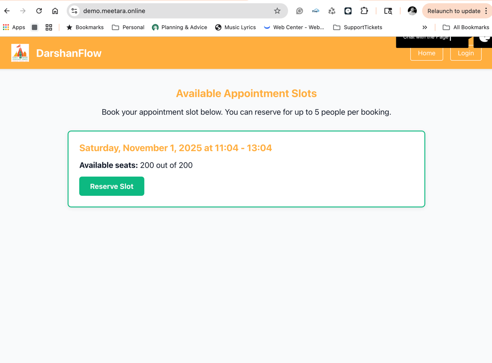
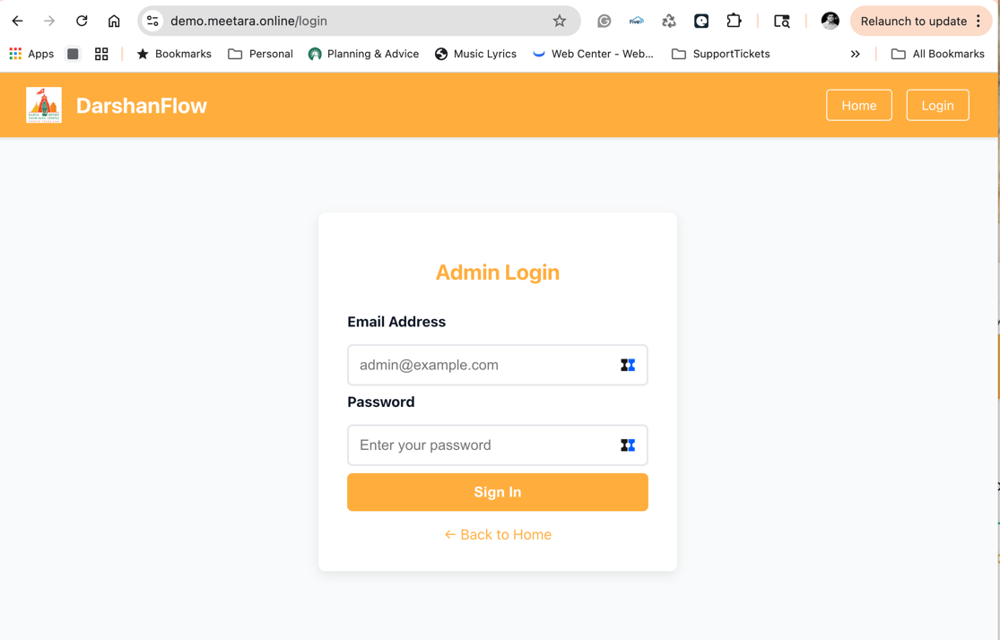
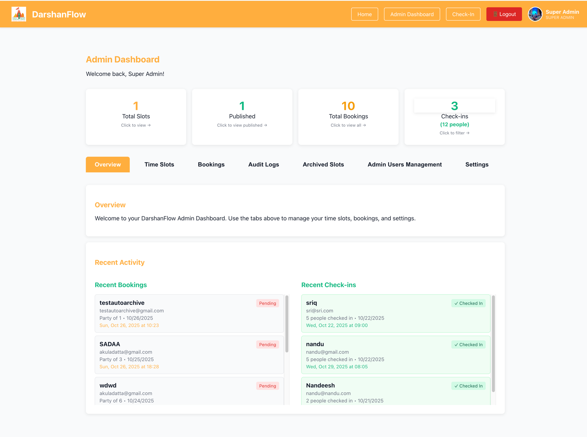
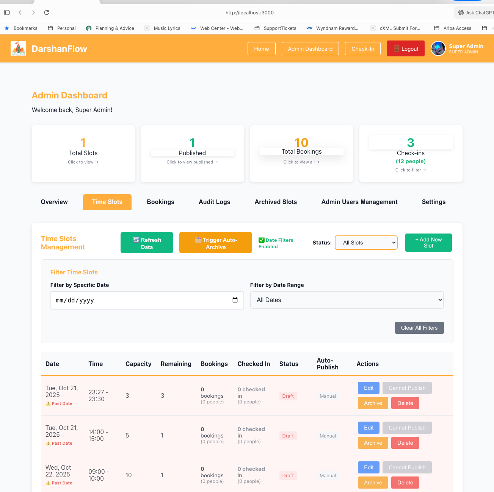
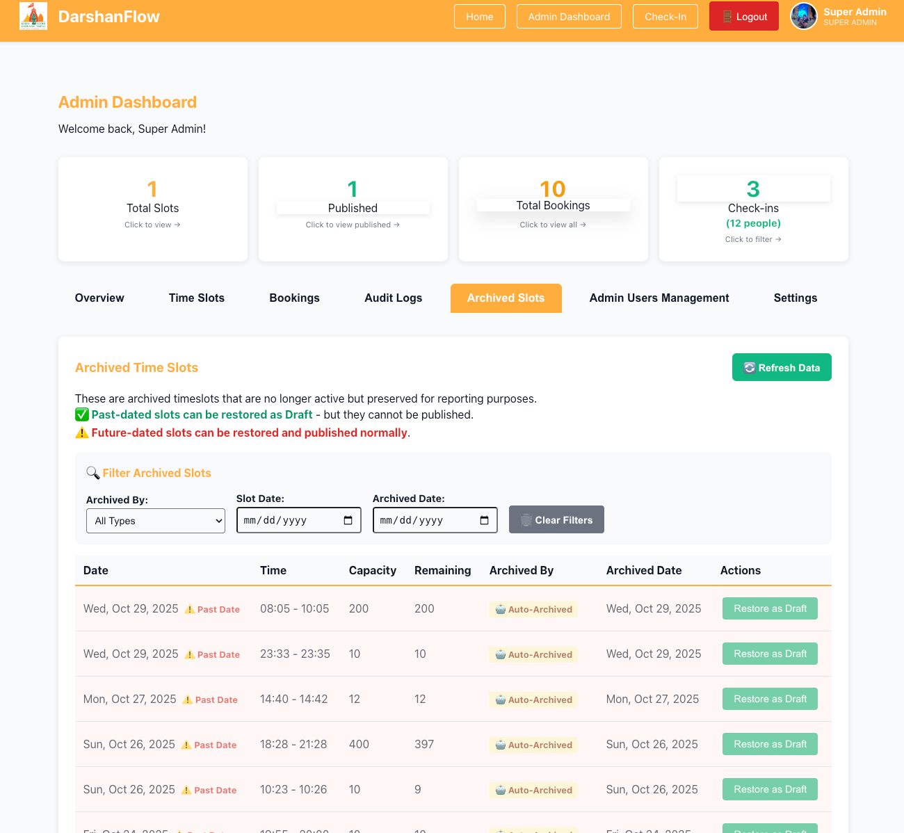
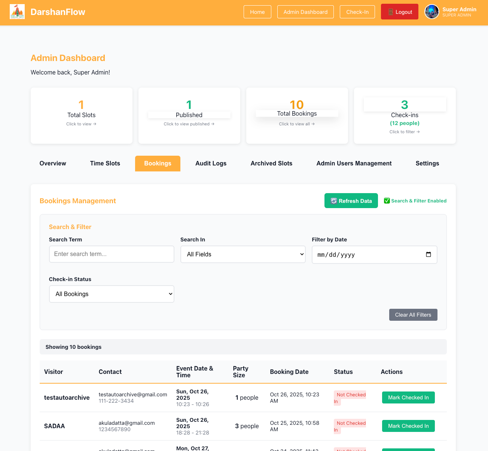
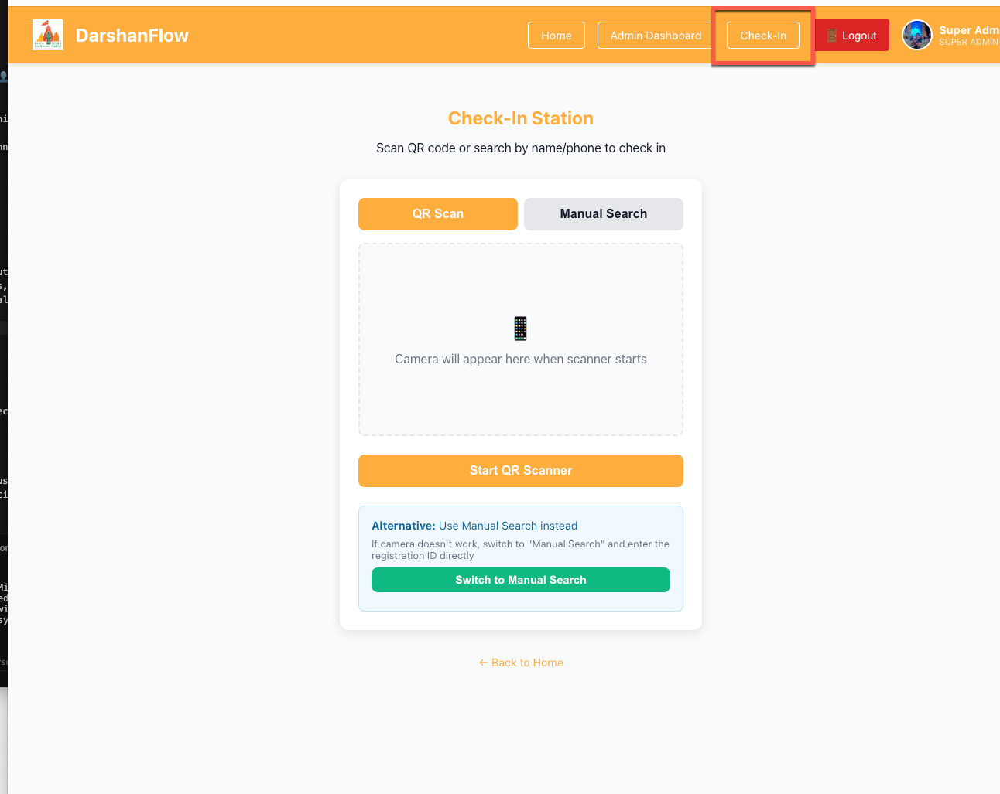
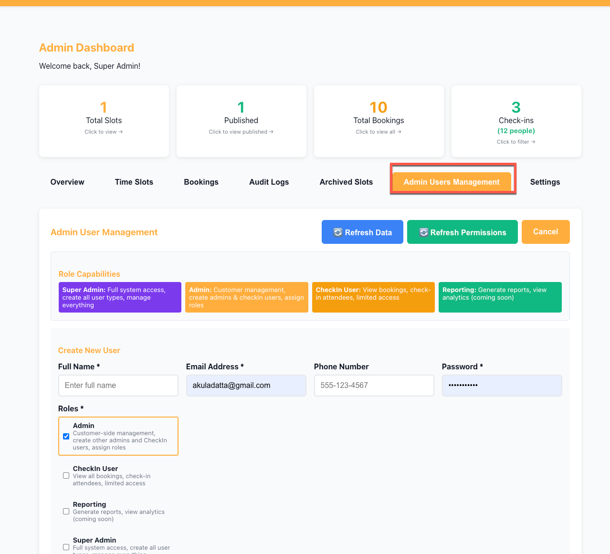
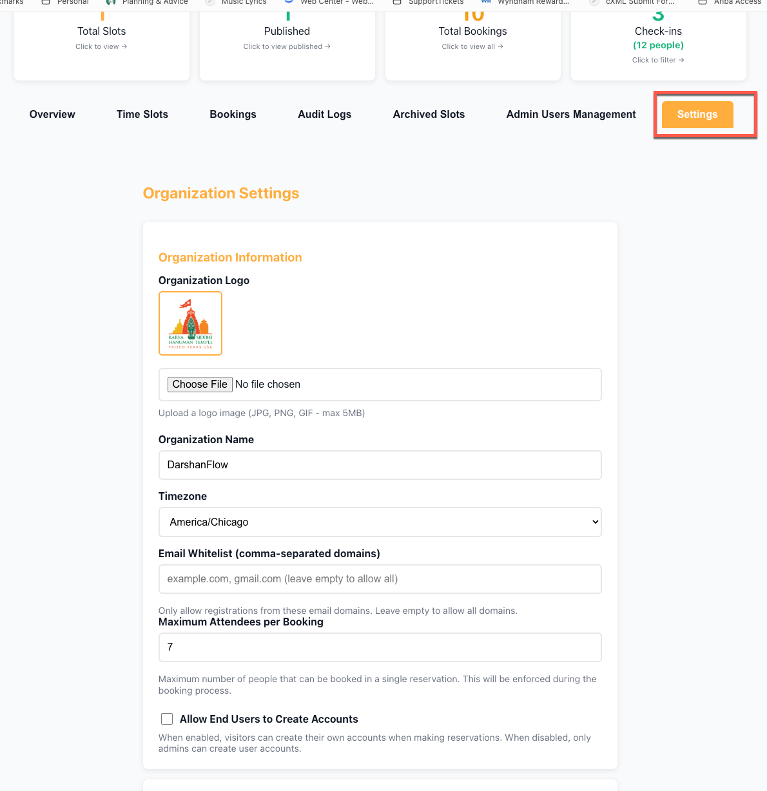
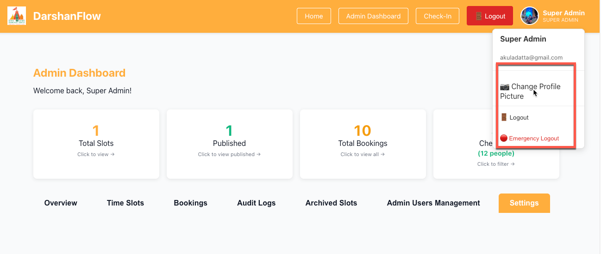

# DarshanFlow - UI Demo Guide

This guide walks through the main UI screens and typical flows for demos, UAT, and onboarding.

> Tip: Use Incognito window to avoid stale caches. Admin panel: `http://localhost:3000/admin`

---

## 1. Public Site (Visitor)



- Landing (Home)
  - Shows organization logo/name and available published time slots
  - CTA buttons: Admin Dashboard (authenticated), Check-In, Login
- Available Appointment Slots
  - Card/table of future, published slots only
  - Each slot shows date, time range, capacity, remaining
  - Action: “Reserve Slot” → Booking form

### Booking Flow

1. Click “Reserve Slot”
2. Fill form: Full Name, Email, Phone, Number of Attendees
   - Max attendees enforced by server-configured `maxAttendees`
3. Submit → Confirmation page (shows details and QR code if enabled)

---

## 2. Admin Login



- Navigate to `http://localhost:3000/admin`
- If not authenticated, redirected to Login
- Enter admin credentials → lands on Admin Dashboard

Header (persistent):

- Left: Brand (organization name/logo)
- Center: Nav Tabs: Overview, Time Slots, Bookings, Audit Logs, Archived Slots, Admin Users Management, Settings
- Right: Profile circle with dropdown:
  - Change Profile Picture (file upload)
  - Logout
  - Emergency Logout

---

## 3. Dashboard (Overview)



- Tiles:
  - Total Slots
  - Published
  - Total Bookings
  - Check‑Ins (quick link to Bookings)
- Recent Activity
  - Recent Bookings (left)
  - Recent Check‑ins (right)
- Interactions:
  - Click tiles to filter/navigate to relevant tab
  - Manual refresh button (where present) to force data reload

---

## 4. Time Slots Management



Main actions:

- Add New Slot (form appears above filters)
  - Fields: Date, Start, End, Capacity, Publish (optional), Auto-publish options
  - Validation: Past-dated/time slots cannot be published (timezone-aware)
- Filters (below the form)
  - Status: All, Draft, Published, Will Auto-Archive, Archived (All, Auto, Admin)
  - Search/Date filters (if enabled)
- Table
  - Shows date, time, capacity, remaining, status
  - Row highlights for past-dated entries
  - Actions per row: Publish/Unpublish, Edit, Archive, Delete

Rules/Notes:

- Past-dated slots cannot be published; button disabled with tooltip
- Auto-archive moves past slots to Archived and sets `archivedBy='system'`
- Restored slots from Archived return as Draft

---

## 5. Archived Slots



- Filters:
  - Archived By: All, 🤖 Auto-Archived, 👤 Admin Archived, 📁 Legacy Archived
  - Slot Date, Archived Date
- Table columns:
  - Date, Time, Capacity, Remaining, Archived By, Archived Date, Actions
- Actions:
  - Restore as Draft (always allowed; cannot publish if still past-dated)

---

## 6. Bookings Management



- Search: by name, email, phone
- Filters: by slot date or date range (mutually exclusive when a specific date is selected)
- Table: booking details, check-in status, party size, actions
- Check-in from this screen: update actual check-in count (validated against original booking and logical limits)

---

## 7. Check‑In Station



- Entry points: Header “Check-In” or direct route
- Modes:
  - Search by name/email/phone
  - Scan QR (if supported in browser)
- Check-in rules:
  - Cannot exceed original party size plus configured safeguards
  - Shows slot window and remaining capacity context

---

## 8. Admin Users Management (RBAC)



- Create/Edit users
- Assign multiple roles per user:
  - Super Admin, Admin, CheckIn User, Reporting
- Super Admins can manage Admin roles; Admins can assign CheckIn/Reporting
- Multi-role display in header and validations across the app

---

## 9. Settings



- Organization
  - Name, Logo upload
- Theme
  - Primary/Secondary/Accent, Background, Text
- Configuration
  - Timezone (used by all comparisons and cron jobs)
  - Allow User Registration
  - Email Whitelist (optional)
  - Maximum Attendees per Booking (`maxAttendees`)
- Save → Applies immediately; some changes require a hard refresh for the UI theme

---

## 10. Header Profile Menu



- Click avatar → dropdown
- Change Profile Picture
  - Opens file picker
  - Uploads to `/api/user/profile-pic`; on success, menu closes and page reloads
- Logout
  - Navigates to `/logout` and clears token
- Emergency Logout
  - Same as logout; prominent styling

---

## 11. Demo Script (Suggested 6–8 minutes)

1. Home → show branding and published slots
2. Reserve slot (party size within limit) → submit → confirmation
3. Admin login → Overview tiles → recent activity
4. Time Slots → create Draft for today+future time → publish
5. Show past slot row → publish disabled tooltip; explain auto-archive job
6. Archived Slots → filter by Auto-Archived vs Admin Archived → Restore as Draft
7. Bookings → search by email → check-in one attendee
8. Settings → change `maxAttendees`, save; demonstrate enforcement on Booking form
9. Profile menu → Change Profile Picture → Logout

---

## 12. Troubleshooting During Demos

- If data looks stale: hard refresh (Cmd+Shift+R)
- If port 3000 busy: `pkill -f "node server.js" && sleep 2 && npm run server`
- If `maxAttendees` type error appears, reopen Settings and save again
- Ensure timezone in Settings matches your expected comparisons

---

## 13. Screenshots

Place PNGs under `docs/images/` with these filenames:

```
images/home.png
images/login.png
images/dashboard.png
images/timeslots.png
images/archived.png
images/bookings.png
images/checkin.png
images/admin-users.png
images/settings.png
images/profile-menu.png
```

If paths differ, update the links above accordingly.
